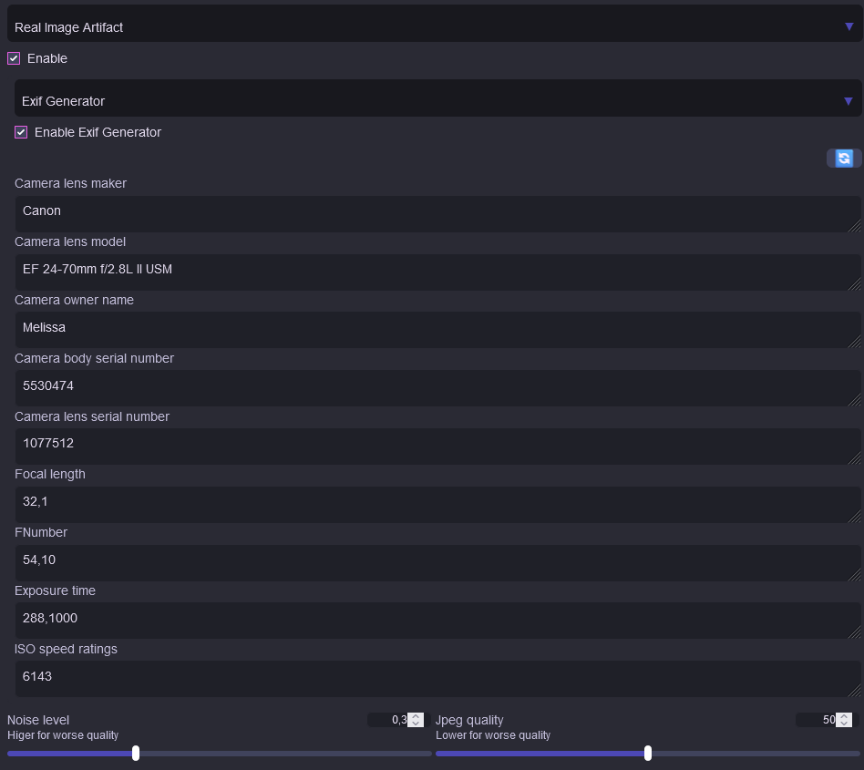

# sdnext-real-image-artifacts

A post processor to add noise, jpeg arifacts and opional exif to an image to make ai generated image feel more real (original code by https://www.reddit.com/user/I_like_lips)

## Example

| Before                           | After                             |
| -------------------------------- | --------------------------------- |
|    |  |
|  |     |
